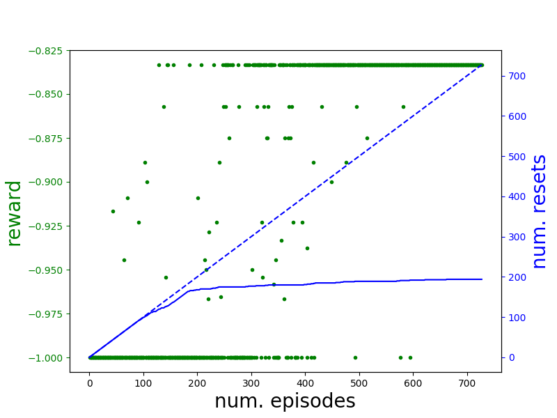

# Leave No Trace

### What is "Leave No Trace"?
*Leave No Trace* is an algorithm for safe reinforcement learning. The key idea is that an agent should only do things that it can undo. For example, a robot should not break a glass, because it will be unable to put it back together; a robot should not walk off a cliff because it cannot un-fall off the cliff.

Leave No Trace was proposed in [Leave no Trace: Learning to Reset for Safe and Autonomous Reinforcement Learning](https://arxiv.org/pdf/1711.06782.pdf). Videos of the algorithm are shown on the [project website](https://sites.google.com/site/mlleavenotrace/). If you use this code, please consider including the following citation:
```
@inproceedings{
  eysenbach2018leave,
  title={Leave no Trace: Learning to Reset for Safe and Autonomous Reinforcement Learning},
  author={Benjamin Eysenbach and Shixiang Gu and Julian Ibarz and Sergey Levine},
  booktitle={International Conference on Learning Representations},
  year={2018},
  url={https://openreview.net/forum?id=S1vuO-bCW},
}
```

##### How does Leave no Trace work?
*Leave No Trace* works by learning two policies. The *forward policy* attempts to complete the main task, such as navigating a maze or running forwards. The *reset policy* attempts to undo the actions of the forward policy. If the forward policy is navigating a maze, the reset policy learns how to navigate back to the start. If the forward policy is running forwards, the reset policy learns how to run back to the start.

##### Limitations

1. Users must manually define a reward function for the reset policy.
2. Users must manually define a function indicating whether the reset policy has successfully reset.
3. Leave no Trace only works in environments where it is possible to go backwards from the goal state to the start state. While this encompasses a wide range of tasks, it excludes tasks such as cooking (a robot cannot un-slice a carrot, un-crack and egg, and un-bake a cake).

If you're interested in working on any of these open problems, feel free to reach out to <eysenbach@google.com>.


### How to use Leave No Trace

We have implemented Leave No Trace as a *safety wrapper*. We wrap the environment in this projective layer to prevent an outside learning algorithm from taking dangerous actions. Under the hood, the safety wrapper learns the reset agent, and uses the reset agent to avoid taking dangerous actions. Leave no Trace abstracts away the safety problem, allowing users to learn safely without any modifications to their learning algorithm:
```
# Add the safety wrapper to the environment
safe_env = SafetyWrapper(env=env, reset_agent=reset_agent, **lnt_params)
# Do regular learning with the safe environment
Agent(env=safe_env, name='forward_agent', **agent_params).improve()
```


##### Installation

0. Clone this repository

  ```git clone sso://user/eysenbach/LeaveNoTrace```

1. Install coach

  ```
  cd coach
  touch coach/__init__.py
  git submodule init
  git submodule update
  ./install.sh
  ```
  In the dialogue that appears, only install the coach dependencies
  requirements.

2. Install the other dependencies.

  ```
  pip3 install gym==0.9.3
  pip3 install mujoco-py==0.5.7
  ```


##### Usage

Basic usage - activate the virtual environment and run the demo script.
  ```
  source coach/coach_env/bin/activate
  python3 demo.py
  ```
After training, you should see a plot that looks like the one below. The green dots show the average per-step reward throughout training. As expected, the agent's reward increases throughout training. The solid blue line shows the cumulative number of hard resets throughout training. Notice that fewer and fewer new hard resets are performed later in training, as the reset agent learns to automatically reset the agent.


##### Adding new environments


##### Debugging

I get the following error when installing coach:
```
Traceback (most recent call last):
  File "/usr/bin/pip3", line 9, in <module>
    from pip import main
ImportError: cannot import name 'main'
```
